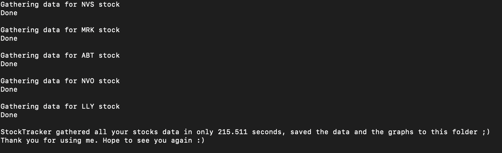

# StockTracker :chart_with_upwards_trend: :chart_with_downwards_trend:

## What is it?
Finds new stocks in specific fiels such as Healthcare, Technology etc. and downloads historical data for all the stocks it found to file as well as visualizes the data on a graph.

## Getting Started
1. Download the project files as a ZIP [here](https://github.com/danesh-23/stocktracker/archive/master.zip) or clone the repo by pasting the command below in your command prompt/terminal.

```
 git clone https://github.com/danesh-23/stocktracker.git
```
2. Before going any further, you need a couple of external libraries to ensure the program is able to run including Keras, OpenCV and Numpy. You should download the latest version of these from their official website [Selenium](https://pypi.org/project/selenium/), [Matplotlib](https://pypi.org/project/matplotlib/#files) and [BeautifulSoup](https://pypi.org/project/beautifulsoup4/) and optionally [Pyautogui](https://pypi.org/project/PyAutoGUI/).  
You may also download these using the command-line using the following commands below.  
```
pip install selenium
```
```
pip install matplotlib
```
```
pip install beautifulsoup4
```
```
pip install PyAutoGUI
```
3. Navigate to the location you downloaded the source files to. You can follow along with the commands below if you are using a Mac.  
```
cd *PATH-OF-STOCKTRACKER.PY*
```
  
  
4. To begin running the program, if youre using an IDE, you just need to run it and if youre using a CLI, simply call python on the file.
```
python3 stocktracker.py
```
  
  
You have now have your very own *Warren Buffett*  
  
Now you have 2 options; 
  * Find new stocks in a particular field and track its data.(healthcare only for now)
  * Track data for a particular stock you have in mind. 
  
5. If you choose the first option to find new stocks, it will ask you for some characteristics you're looking for such as the size of the companies eg: Mega(>200 billion)/Large(10b-200b) etc. Then, it will ask you how many new companies you want to find and gather data for; the more companies it finds, the longer it takes to gether more data. 

  

Now, watch the magic happen!  
  
6. StockTracker will open up a FireFox browser and navigate to the NASDAQ website and select the options you chose automatically and choose stocks that fit your preference.  
  
  
  

7. Now, it starts gathering the historical data for each of the new stocks it found and should take a couple of minutes depending on the number of companies you wanted it to find as well as the strength of your internet connection but for the default of 5 companies, it should take approximately 3-10 minutes and will look like below once it's done.  

. 

You can now see all the downloaded stocks historical data as well as the charts drawn from this data in your current folder and these are what the data would look like.  
  
  
  

8. Now that you have successfully found new stocks for yourself, you can use our second option and track a specific stock which you like. Selecting the second option will show the following.  

  

9. You only need to enter the symbol for the company and in this example we use Shopify which is SHOP and it produces the same result as above, it saves the data but upon completion, it automatically presents the graph produced from the gathered data as shown below.
  

TA-DAA!! You can now become the Stock-King with all this power :crown:  

## A little about this project  

This project has a little bit of a backstory to it that is interesting if you're interested. Since you're still reading, I take it you are :) So, I was talking to my dad on a Saturday morning and he was telling me about his stocks and how some of them were going down due to the economy and how much he had made and lost over the years and he mentioned that it would be really useful to keep an eye out for pharmaceutical/healthcare sector stocks as with the pandemic going on, all eyes were focused on them and it was ripe for potential in an investors eyes. He then asked me, knowing my fascination and skills for automating and scraping data to make my life easier, if I could make a program that can monitor stocks in certain sectors and somehow visualize the data to show its pattern of growth.  
  
This piqued my interest and I set out on creating StockTracker, a program that could track stocks in certain sectors and help investors to find new and random stocks that matched their criteria. I worked on StockTracker while studying for technical interview questions at Google/Apple etc. just for the fun of it so I worked on it on the rest days I had once a week as a relaxant for a few weeks. Once I was done studying, I worked on it daily trying to implement the core features and learn how I could go about doing them as I was unfamiliar with some external libraries completely so I studied them and searched how I could do certain things and managed to complete the system a few weeks later, many ideas of features yet to be implemented but a good start.  
  
What I took away from this project aside from the significant knowledge on certain libraries and a little more on stocks, was a realisation that aside from the amazement of seeing something you built in the hands of others; the true joy for me was in solving obstacles people have(maybe not huge obstacles/perfect solutions) and using a machine to do that. The very idea of using a machine to aid in solving real problems(small or large) people have simply grows the burning passion and love I have for what I do. (sorry for the slightly longer background on the project than usual) Hope you enjoyed the journey :)  
  
## Reporting Bugs

To report a bug, you may use the [Bug Report template](.github/ISSUE_TEMPLATE/bug_report.md)

## Feature Request

If you have any ideas of interesting features you would like added, you may fill the [Feature Request form](.github/ISSUE_TEMPLATE/feature_request.md)

## Project maintainers

This project is maintained by Danesh Rajasolan(me). Use of this project under the [MIT License](LICENSE.md).
